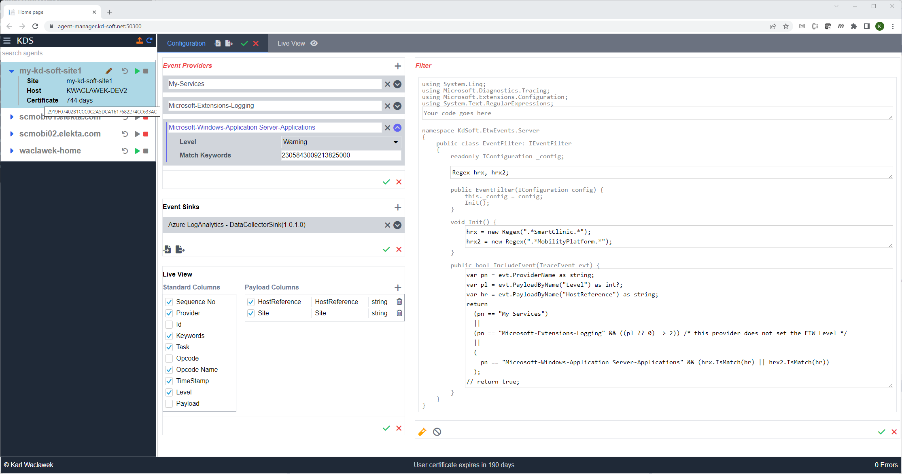

# ETW LISTENER

A system to extract ETW (Event Tracing for Windows) events and collect them centrally.

## Overview

An EtwListener deployment consists of two types of nodes:
1. One or more agents: they are installed on each machine that needs log collection.
2. One agent manager: it configures, starts and stops the agents.

Agents communicate with the agent manager by establishing an SSE (Server Sent Events) connection to the configured agent manager. The agent manager in turn uses this connection to "push" control messages to the agents.
- Some control messages update the agent's configuration or start/stop the agent.
- Some control messages prompt the agent to report status updates.
- All authentication between Agent and Agent Manager, as well as between User and Agent Manager is based on the use of client certificates.

A typical deployment example with Elastic Search as log destination:

## Agent

An agent is a Windows service that can make outgoing network connections.
- It is always connected to the agent manager configured during the install.
- Depending on configuration, the agent can also connect to an external endpoint to send the log events to.
- For installation instructions, see [Install.md](EtwEvents.PushAgent/Install.md) and [deploy/ReadMe.md](EtwEvents.PushAgent/deploy/ReadMe.md).

## Agent Manager

The agent manager is a web site that allows for configuring, starting and stopping connected agents.
- The agent manager does not connect to the agents, it is the agents' responsibility to connect to the agent manager.
- For build and run instructions, see [ReadMe.md](EtwEvents.AgentManager/ReadMe.md).
- Installation can be done using Docker, or as described in [Install.md](EtwEvents.AgentManager/Install.md) and [deploy/ReadMe.md](EtwEvents.AgentManager/deploy/ReadMe.md).

### UI Overview

The UI consists of two main sections, a side bar and a main pane for configuration settings or a live-view.
- The sidebar shows a list of connected agents.
- The configuration pane contains settings for the selected agent:
  - **ETW Providers**
  - **Filter** logic (C# code) to be applied to each ETW event.
  - **Event Sinks**, where the ETW events are sent to.
  - **Live View** display settings.

  All configurations settings can be applied to the running agent and will take effect as soon as possible.
  Settings can be exported and importedfrom/to JSON files.

- Side Bar:
  - The agent can be started (green triangle) or stopped (red square).
  - Expanding an agent entry shows more details for the agent, including how long the agent's client certificate is still valid.

- Main pane - configuration:
  - The *ETW Providers* section has these fields:
    - The provider's' "well-known" name, or the provider's' GUID.
    - Level: except for "Always", levels further down in the list log more than levels further up.
    - Match Keywords: A keyword (8-byte bitmask) that enables efficient filtering of events from specific provider subcomponents. The meaning is provider-specific.
  - The *Filter* section has a code sceleton for a C# class:
    - When the class is instantiated, the Init() method will be called.
    - For each ETW event received from the provider(s), the IncludeEvent(TraceEvent evt) method will be called.
      - If it returns `true` then the event will be included, otherwise it will be ignored.
    - The code can be tested for syntactical correctness with the orange "Test" button.
  - The *Event Sinks* section:
    - Has a common set of fields for all types of event sinks:
      - Batch Size: events will be sent in batches of that size, if they a received very frequently.
      - Max Write Delay: if events are received infrequently, they will be sent no later than the specified delay, even if the batch is not full.
      - Persistent Buffer: if this flag is checked, then events will be buffered on disk while there is an interruption in delivering them to the event sink.
    - Has specific fields for each event sink, divided into two groups, *Options* and *Credentials*.
  - The *Live View* section decribes which columns are shown in the live view:
    - There are standard columns for the standard fields in an ETW event.
    - There are *Payload* columns that are specific to each event type.
    - The live view is meant for testing the configuration, it is not intended as a proper event sink.

- Footer
  - Shows how long the user's client certificate is still valid.
  - If any errors in communicating with an agent occurred then the error number will be > 0 and clicking on the Errors label will slide up a list of errors.

### Updating Agent Certificates
Occasionally, an agent's certificate will expire. When that time approaches a warning indicator will show next to the client certificate's expiry countdown.

- Certificate updates are triggered by dropping one or more new certificates into the *AgentCerts* folder in the AgentManager's install directory.
  - This allows multiple methods of deploying certificates, as the only requirement is that they end up in the AgentCerts directory.
  - Certificates can also be uploaded through the UI (upload icon at top of side bar).
  - A successful install can be checked by observing a change in the expiry countdown, or by checking if the thumbprint has changed (hover over "Certificate" label).

- Certificates must conform to these requirements:
  - The Subject Common Name must match the agent's name as displayed in the UI (as it reflects the current certificate's Subject Common Name).
  - If the certificate has the *role* attribute (OID 2.5.4.72) in the Subject set to "etw-pushagent" it will be authorized automatically, otherwise it's Common Name will need to be listed in appsettings.json.
  - The following file extensions are recognized: .pem, .crt, .pfx, .p12 and .cer.
  - If the file is PEM encoded then the private key must be unencrypted.
  - If the file is PKCS#12 encoded, then the password (for the private key) must be empty/blank.
  - Should a certificate not disappear from the the AgentCerts folder after a few minutes then check the AgentManager's current log file for the reason.
 